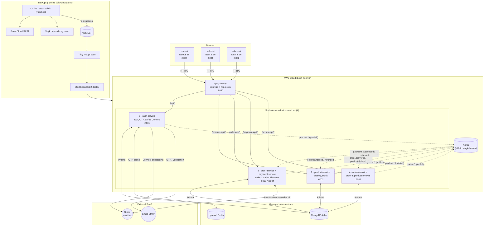

# E-Shop Microservices Architecture

This document is the canonical architecture reference for the CTSE
SE4010 group assignment. All four student-owned microservices are shown
together with the api-gateway, the three Next.js UIs, the AWS
infrastructure they run on, and the data + external services they
depend on.

## High-level diagram



## Service responsibility matrix (4 students)

| # | Owner | Service(s) | REST surface | Publishes (Kafka) | Consumes (Kafka) |
|---|---|---|---|---|---|
| 1 | Student A | `auth-service` | `/api/*` (login, register, refresh-token, Stripe Connect) | — | — |
| 2 | Student B | `product-service` | `/product-api/*` (catalog, search, seller CRUD) | `product.created/updated/deleted` | `order.cancelled/refunded` (stock restoration) |
| 3 | Student C | `order-service` + `payment-service` | `/order-api/*`, `/payment-api/*` (orders, Stripe PaymentIntent + webhook) | `order.placed/confirmed/cancelled/refunded`, `payment.created/succeeded/failed/refunded` | `payment.succeeded/refunded`, `order.cancelled` |
| 4 | Student D | `review-service` | `/review-api/*` (order & product reviews) | `review.created/deleted` | `order.delivered`, `product.deleted` |

`api-gateway` is shared infrastructure (single Express reverse proxy on
:8080); it is not counted toward the four assignment microservices.

## Inter-service flow examples

### Place order + Stripe payment

```
user-ui --POST /order-api/orders--> order-service (order: pending)
user-ui --POST /payment-api/create-payment-intent--> payment-service
  └─> Stripe.paymentIntents.create  → returns clientSecret
user-ui --Stripe Elements (clientSecret)--> Stripe (3-D Secure if needed)
Stripe --webhook payment_intent.succeeded--> payment-service
  └─> publishes payment.succeeded (Kafka)
order-service consumes payment.succeeded
  ├─> order.status = confirmed
  └─> publishes order.confirmed
payment-service runs Stripe transfers → seller Connect accounts
```

### Refund

```
admin-ui --POST /payment-api/admin/refund/:paymentId--> payment-service
payment-service --Stripe.refunds.create--> Stripe
payment-service publishes payment.refunded (Kafka)
order-service consumes payment.refunded
  ├─> order.status = refunded
  └─> publishes order.refunded (with stockWasDecremented flag)
product-service consumes order.refunded
  └─> increments stock for items in the order
```

### Review

```
seller-ui --PUT /order-api/seller/orders/:id/items/:itemId/status (delivered)--> order-service
order-service publishes order.delivered (Kafka) when all items are delivered
review-service consumes order.delivered (eligibility log)
user-ui --POST /review-api/orders/:orderId/review--> review-service
review-service publishes review.created (Kafka)
```

## DevOps pipeline

| Stage | Workflow | What it does |
|---|---|---|
| CI | `.github/workflows/ci.yml` | `nx run-many` lint → test → build → typecheck on every PR |
| SAST | same workflow + `sonar-project.properties` | SonarCloud quality gate |
| Dependency CVEs | `.github/workflows/snyk.yml` | Snyk `--all-projects --severity-threshold=high` |
| Build & push | `.github/workflows/build-and-push.yml` | Multi-stage Docker build per service → AWS ECR |
| Image CVEs | same workflow (Trivy step) | Aqua Trivy scan for HIGH / CRITICAL on each image |
| Deploy | `.github/workflows/deploy-ec2.yml` | AWS SSM `Run Command` pulls new image, restarts container on EC2 |

OIDC is used for GitHub → AWS authentication (no long-lived IAM keys).
Each EC2 host has an instance profile with minimum permissions to pull
from ECR.

## Security controls (assignment rubric)

- **JWT + role-based authz** in `packages/middleware/isAuthenticated.ts`
  and `packages/middleware/autherizeRoles.ts`. Secrets validated at
  module load (fails fast on missing env).
- **Stripe webhook signature verification** is mandatory in the payment
  service — unsigned requests are rejected.
- **CORS** locked down via `ALLOWED_ORIGINS` (env-driven, defaults to
  localhost only).
- **Secrets never in git**: `.gitignore` blocks all `.env*` except
  `.env.example`. Real values live in GitHub Secrets and per-host
  `/opt/<service>/.env` files. See `docs/SECRETS_TO_ROTATE.md`.
- **SAST / DAST**: SonarCloud (code) + Snyk (deps) + Trivy (images).
- **Least privilege on AWS**: GitHub Actions assumes a single OIDC role
  scoped to the ECR repos and SSM Run Command on tagged EC2 instances.

## How to export this diagram

GitHub renders the Mermaid block above directly in this file. To embed
the PNG in your report:

1. Open this file on GitHub and screenshot the rendered diagram, or
2. Run `npx -y @mermaid-js/mermaid-cli -i docs/architecture.md -o docs/architecture.png`.
